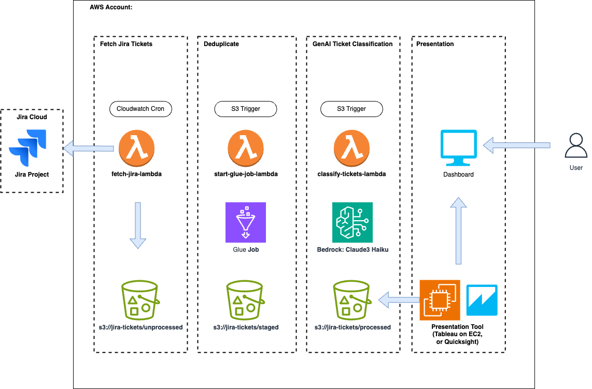

# JiraCloud Ticket Analyzer

> Jira Ticket Classification

[Classify Atlassian Jira tickets with GenAI on Amazon Bedrock](https://towardsdatascience.com/classify-jira-tickets-with-genai-on-amazon-bedrock-69450d4d8b21)

A Python-based AWS solution for automated Jira ticket classification using Amazon Bedrock. This project helps Jira users automate ticket categorization featuring S3 integration, AWS Glue deduplication, LLMs, and Terraform deployment.

## Overview

Jira Ticket Classification is an automated system designed to classify Jira tickets using Amazon Bedrock's AI capabilities. This project can be used with Jira Server exports, providing automation capabilities similar to those available in Jira Cloud.

## Architecture Diagram



## Features

- Automatically classifies Jira tickets based on their content
- Utilizes Amazon Bedrock for AI-powered classification
- Processes Jira ticket exports placed in S3
- Uses AWS Glue for data deduplication
- Designed to work with Jira Server exports


**Note**: Deduplication is important if you allow users to manually upload Jira exports and also run the automatic pull. If you can ensure no incremental imports contain duplicates, you can remove the AWS Glue job.

## How It Works

1. **Data Input**: Jira ticket exports are placed in the `/unprocessed` folder of the deployed S3 bucket.

2. **Data Processing**: The system processes the exported tickets.

3. **Bedrock Classification**: Ticket data is sent to Amazon Bedrock, which uses a pre-defined classification prompt to categorize each ticket.

4. **Deduplication**: AWS Glue ensures no duplicate classifications are processed, maintaining data integrity.

5. **Results**: Classification results are stored and can be used to update the original Jira tickets or for further analysis.

## Components

- **Lambda Function**: Handles the main logic for ticket processing and classification.
- **Amazon Bedrock**: Provides the AI model for ticket classification.
- **AWS Glue**: Manages data deduplication.
- **S3**: Stores Jira exports and classification results.
- **Secrets Manager**: Stores our Jira API key, base url, and email address for pulling Jira tickets.

## Setup and Configuration

**Important Notice**: This project deploys resources in your AWS environment using Terraform. You will incur costs for the AWS resources used. Please be aware of the pricing for services like Lambda, Bedrock, Glue, and S3 in your AWS region.

**Required Permissions**: You need elevated permissions, specifically Power User permissions, to deploy the Terraform stack.

To set up the project:

1. Update main.tf fetch_jira_issue_lambda's environment variable PROJECT_IDS_COMMA_SEPARATED to include the projectIds you want to pull
2. Navigate to the `infrastructure` folder in the project.
3. Run `terraform init` to initialize the Terraform working directory.
4. Run `terraform apply` to create the resources in your AWS environment.
5. Go to secrets manager and update the Jira secret with your Jira configuration

To tear down the project:

1. Navigate to the `infrastructure` folder.
2. Run `terraform destroy` to remove all resources created by this project.

## Security
Make sure to run tfsec on the infrastruction folder any time you make an additional change to the code.

Run TFSec
```bash
$ tfsec .
```

**Suppressed Warnings**
Make sure to run tfsec on the infrastruction folder any time you make an additional change to the code. These security warnings have been suppressed, but review these prior to putting implementing this solution in production. Additionally, this sample repo is using AWS managed keys. It's encouraged to use customer managed keys (CMKs) in a prod environment.

1. Secrets Manager "aws-ssm-secret-use-customer-key": This warning requires us to use a KMS key for our secret.
2. S3 "aws-s3-enable-bucket-logging": Remove and turn on if bucket logging makes sense for your use case
3. S3 Bucket Encyption "aws_s3_bucket_server_side_encryption_configuration": We are using an AWS managed encryption key
4. Lambda "aws-lambda-enable-tracing": Turn on tracing if this makes sense for your project.

## Usage

1. Export tickets from your Jira Server instance.
2. Place the exported ticket data in the `/unprocessed` folder of the S3 bucket created by the Terraform script.
3. The system will automatically process new files in this folder.
4. Retrieve classification results from the designated output location in S3.

## Requirements

- AWS Account with access to Lambda, Bedrock, Glue, and S3
- Terraform installed on your local machine
- Power User permissions in your AWS account
- Ability to export tickets from Jira Server (Jira Server instance not required)

## Contributing

Contributions to improve the project are welcome. Please feel free to submit pull requests or open issues to discuss potential enhancements.

## License

This project is licensed under the MIT License. See the LICENSE file for details.

## Support

For support or to report issues, please open an issue in the project's GitHub repository.